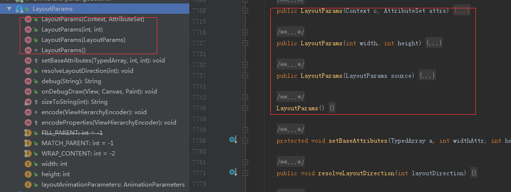
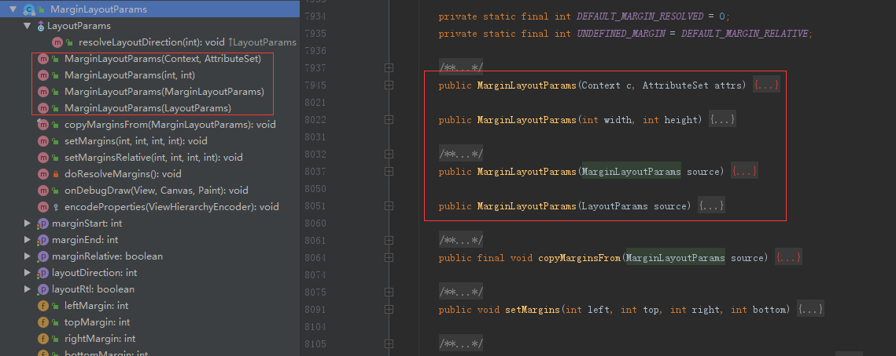
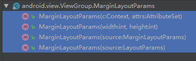
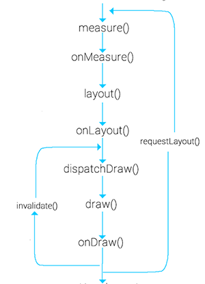

```xml
<de.hdodenhof.circleimageview.CircleImageView
    xmlns:app="http://schemas.android.com/apk/res-auto"
    android:id="@+id/profile_image"
    android:layout_width="96dp"
    android:layout_height="96dp"
    android:src="@drawable/profile"
    app:civ_border_width="2dp"
    app:civ_border_color="#FF000000"/>
```

# 自定义viewgroup时不走ondraw方法

当我们自定义一个View时会重写他的3个方法，onMeasure(),onLayout(),onDraw()方法，
但是自定义一个ViewGroup的时候要重写onMeasure(),onLayout(),dispatchDraw()这3个方法。

但是我们设置了viewgroup的背景后，也会调用ondraw方法

[自定义ViewGroup不走onDraw()方法的问题](https://www.jianshu.com/p/7d2f4cba2042)

# onMeasure

```
    @Override
    protected void onMeasure(int widthMeasureSpec, int heightMeasureSpec) {
        System.out.println("===============onMeasure==================");

        //measureChildren或者measureChild之后 
        //child : getMeasuredWidth、getMeasuredHeight才会获取到值
        
        //测量child方式一
//        measureChildren(widthMeasureSpec, heightMeasureSpec);

        //测量child方式二
        int childCount = getChildCount();
        for (int i = 0; i < childCount; i++) {
            View child = getChildAt(i);
            if (child.getVisibility() != View.GONE) {
                measureChild(child, widthMeasureSpec, heightMeasureSpec);
            }
        }

        //必须
        super.onMeasure(widthMeasureSpec, heightMeasureSpec);
        //或者
        //setMeasuredDimension(getMeasuredWidth(),getMeasuredHeight());
    }
```

# LayoutParams

``` 
//支持layout_width和layout_height
public LayoutParams(Context c, AttributeSet attrs) {
    TypedArray a = c.obtainStyledAttributes(attrs, R.styleable.ViewGroup_Layout);
    setBaseAttributes(a,
            R.styleable.ViewGroup_Layout_layout_width,
            R.styleable.ViewGroup_Layout_layout_height);
    a.recycle();
}

//布局文件被填充为对象的时候调用，是下面几个方法中最重要的，如果不重写它，我么布局文件中设置的布局参数都不能拿到。
//其他几个方法我们最好也能重写一下
public LayoutParams generateLayoutParams(AttributeSet attrs) {
    return new LayoutParams(getContext(), attrs);
}

protected LayoutParams generateLayoutParams(ViewGroup.LayoutParams p) {
    return p;
}

protected LayoutParams generateDefaultLayoutParams() {
    return new LayoutParams(LayoutParams.WRAP_CONTENT, LayoutParams.WRAP_CONTENT);
}
```



# MarginLayoutParams

``` 
//支持layout_marginxxx属性
public MarginLayoutParams(Context c, AttributeSet attrs) {
    super();

    TypedArray a = c.obtainStyledAttributes(attrs, R.styleable.ViewGroup_MarginLayout);
    setBaseAttributes(a,
            R.styleable.ViewGroup_MarginLayout_layout_width,
            R.styleable.ViewGroup_MarginLayout_layout_height);

    int margin = a.getDimensionPixelSize(
            com.android.internal.R.styleable.ViewGroup_MarginLayout_layout_margin, -1);
    if (margin >= 0) {
        leftMargin = margin;
        topMargin = margin;
        rightMargin= margin;
        bottomMargin = margin;
    } else {
        int horizontalMargin = a.getDimensionPixelSize(
                R.styleable.ViewGroup_MarginLayout_layout_marginHorizontal, -1);
        int verticalMargin = a.getDimensionPixelSize(
                R.styleable.ViewGroup_MarginLayout_layout_marginVertical, -1);

        if (horizontalMargin >= 0) {
            leftMargin = horizontalMargin;
            rightMargin = horizontalMargin;
        } else {
            leftMargin = a.getDimensionPixelSize(
                    R.styleable.ViewGroup_MarginLayout_layout_marginLeft,
                    UNDEFINED_MARGIN);
            if (leftMargin == UNDEFINED_MARGIN) {
                mMarginFlags |= LEFT_MARGIN_UNDEFINED_MASK;
                leftMargin = DEFAULT_MARGIN_RESOLVED;
            }
            rightMargin = a.getDimensionPixelSize(
                    R.styleable.ViewGroup_MarginLayout_layout_marginRight,
                    UNDEFINED_MARGIN);
            if (rightMargin == UNDEFINED_MARGIN) {
                mMarginFlags |= RIGHT_MARGIN_UNDEFINED_MASK;
                rightMargin = DEFAULT_MARGIN_RESOLVED;
            }
        }

        startMargin = a.getDimensionPixelSize(
                R.styleable.ViewGroup_MarginLayout_layout_marginStart,
                DEFAULT_MARGIN_RELATIVE);
        endMargin = a.getDimensionPixelSize(
                R.styleable.ViewGroup_MarginLayout_layout_marginEnd,
                DEFAULT_MARGIN_RELATIVE);

        if (verticalMargin >= 0) {
            topMargin = verticalMargin;
            bottomMargin = verticalMargin;
        } else {
            topMargin = a.getDimensionPixelSize(
                    R.styleable.ViewGroup_MarginLayout_layout_marginTop,
                    DEFAULT_MARGIN_RESOLVED);
            bottomMargin = a.getDimensionPixelSize(
                    R.styleable.ViewGroup_MarginLayout_layout_marginBottom,
                    DEFAULT_MARGIN_RESOLVED);
        }

        if (isMarginRelative()) {
           mMarginFlags |= NEED_RESOLUTION_MASK;
        }
    }

    final boolean hasRtlSupport = c.getApplicationInfo().hasRtlSupport();
    final int targetSdkVersion = c.getApplicationInfo().targetSdkVersion;
    if (targetSdkVersion < JELLY_BEAN_MR1 || !hasRtlSupport) {
        mMarginFlags |= RTL_COMPATIBILITY_MODE_MASK;
    }

    // Layout direction is LTR by default
    mMarginFlags |= LAYOUT_DIRECTION_LTR;

    a.recycle();
}
```




我们可以选择继承ViewGroup.LayoutParams，
这样的话我们的布局只是简单的支持layout_width和layout_height；
也可以继承MarginLayoutParams，就能使用layout_marginxxx属性了。

``` 
LayoutParams in ViewGroup (android.view)
    MarginLayoutParams in ViewGroup (android.view)
        LayoutParams in ActionBar (android.app)
            LayoutParams in Toolbar (android.widget)
        LayoutParams in GridLayout (android.widget)
        LayoutParams in FrameLayout (android.widget)
        LayoutParams in LinearLayout (android.widget)
            LayoutParams in RadioGroup (android.widget)
            LayoutParams in TableRow (android.widget)
            LayoutParams in TableLayout (android.widget)
            LayoutParams in ActionMenuView (android.widget)
        LayoutParams in RelativeLayout (android.widget)
    LayoutParams in AbsoluteLayout (android.widget)
    LayoutParams in AbsListView (android.widget)
    LayoutParams in WindowManager (android.view)
    LayoutParams in Gallery (android.widget)
```

重写MarginLayoutParams的方法:



[MarginLayoutParams--一个可以在代码中直接设置margin的方法](https://blog.csdn.net/u011374875/article/details/52150471)

[自定义控件知识储备-View的绘制流程](https://blog.csdn.net/yisizhu/article/details/51527557#t2)

[自定义控件知识储备-LayoutParams的那些事](https://blog.csdn.net/yisizhu/article/details/51582622)

[一个FlowLayout带你学会自定义ViewGroup](https://blog.csdn.net/yisizhu/article/details/51679219)

如果要为children定义布局属性，如layout_gravity，则需要自定义LayoutParams，并且重写ViewGroup相关的方法。

# requestLayout与invalidate的区别

参考资料：
Android View 深度分析requestLayout、invalidate与postInvalidate
https://blog.csdn.net/a553181867/article/details/51583060

笔记：

1 requestLayout会标记View的mPrivateFlags的PFLAG_FORCE_LAYOUT,并且逐层向上调用，标记父View的标记位，最终调用ViewRootImpl的requestLayot

2 ViewRootImpl的RequestLayout方法会调用scheduleTraversals方法，最终调用measure，layout，draw三个过程

3 invalidate方法会设置PFLAG_DIRTY标记位， 并且循环向上调用，最终调用ViewRootImpl的invalidateChildParent方法，
在该方法中，合并所有dirty区域，并且调用scheduleTraversals方法，
因为没有设置PFLAG_FORCE_LAYOUT标记位，因此不会measure和layout，只会draw

总结：

requestLayout会重新measure，layout，draw整个View树

invalidate只会重新draw需要重新绘制的区域，不会measure和layout



# 自定义ViewGroup类

1. 自定义CustomViewGroup继承ViewGroup

2. 实现多个构造函数

3. 重写onMeasure和onLayout

（1）onMeasure 设置viewgroup的大小(特别考虑wrap_content，否则和match_parent的效果一致盛满)
（2）onLayout 设置如何摆放子View
（3）generateLayoutParams 设置LayoutParams

[鸿洋：Android 手把手教您自定义ViewGroup（一）](https://blog.csdn.net/lmj623565791/article/details/38339817)

[鸿洋：Android 自定义View (一)](https://blog.csdn.net/lmj623565791/article/details/24252901)

[鸿洋：Android 自定义View (二) 进阶](https://blog.csdn.net/lmj623565791/article/details/24300125)

[刘望舒 ：Android View体系（十一）自定义ViewGroup](http://liuwangshu.cn/application/view/11-custom-viewgroup.html)

[open-Xu：自定义控件高手](https://blog.csdn.net/u010163442/column/info/14247)

[自定义ViewGroup (1)支持margin，gravity以及水平，垂直排列 原 荐](https://my.oschina.net/fengheju/blog/196266)
[自定义ViewGroup (2)支持滑动，并处理多指触摸可能产生的跳动问题 原 荐](https://my.oschina.net/fengheju/blog/196455)
[自定义ViewGroup (3) 与子View之间 Touch Event的拦截与处理 原](https://my.oschina.net/fengheju/blog/196608)

[android群英传：自定义ViewGroup](https://www.kancloud.cn/alex_wsc/heros/523265)

[android自定义viewgroup初步之一----抽屉菜单](https://www.kancloud.cn/digest/wingscustomview/129798)

[Android 自定义ViewGroup入门实践:理论](https://github.com/HotBitmapGG/AndroidInterview/blob/master/android/Android%20%E8%87%AA%E5%AE%9A%E4%B9%89ViewGroup%E5%85%A5%E9%97%A8%E5%AE%9E%E8%B7%B5.md)

[菜鸟教程:1.3 自定义 ViewGroup](https://www.runoob.com/w3cnote/android-advance-viewgrouphtml.html)


# 横向滚动

[自定义ViewGroup（1）--横向布局](https://blog.csdn.net/qq_18148011/article/details/53761543)

[ScrollerLayout——可横向滚动的自定义viewgroup](https://blog.csdn.net/Android_Study_OK/article/details/51351736)

[双向滑动悬停，无需嵌套，自定义 ViewGroup 完胜 ScrollView&ViewPager。](https://juejin.im/entry/592098870ce46300694dc6bb)

[自定义viewgroup（5）--可滚动布局，GestureDetector手势监听](https://blog.csdn.net/qq_18148011/article/details/53761587)

[详细讲解自定义ViewGroup+Scroller+VelocityTracker做出Launcher滑动](https://blog.csdn.net/u014649337/article/details/38302535)

# 

[Android开发实践：自定义ViewGroup的onLayout()分析](https://blog.51cto.com/ticktick/1542200)

[Android-自定义ViewGroup-LayoutParams+Margin+Padding相关](https://zhuanlan.zhihu.com/p/47750879)

[每日一问 自定义 ViewGroup 的时候，关于 LayoutParams 有哪些注意事项？](https://www.wanandroid.com/wenda/show/8603)

[自定义 View 案例二：自定义简易 RelativeLayout](https://xiaozhuanlan.com/topic/4216350789)

[Android API：自定义ViewGroup](https://blog.csdn.net/true100/article/details/51547573)

# measureChildren 与 measureChild 与 measureChildWithMargins


**measureChildren**

measureChildren中会遍历执行measureChild

内部调用 measureChild() 对每一个子视图进行 measure 操作

``` 
/**
 * Ask all of the children of this view to measure themselves, taking into
 * account both the MeasureSpec requirements for this view and its padding.
 * We skip children that are in the GONE state The heavy lifting is done in
 * getChildMeasureSpec.
 *
 * @param widthMeasureSpec The width requirements for this view
 * @param heightMeasureSpec The height requirements for this view
 */
protected void measureChildren(int widthMeasureSpec, int heightMeasureSpec) {
    final int size = mChildrenCount;
    final View[] children = mChildren;
    for (int i = 0; i < size; ++i) {
        final View child = children[i];
        if ((child.mViewFlags & VISIBILITY_MASK) != GONE) {
            measureChild(child, widthMeasureSpec, heightMeasureSpec);
        }
    }
}
```
**measureChild** 

measureChild会考虑child的【padding和width】，然后再会执行child.measure()方法

为指定的子视图进行measure操作
``` 
/**
 * Ask one of the children of this view to measure itself, taking into
 * account both the MeasureSpec requirements for this view and its padding.
 * The heavy lifting is done in getChildMeasureSpec.
 *
 * @param child The child to measure
 * @param parentWidthMeasureSpec The width requirements for this view
 * @param parentHeightMeasureSpec The height requirements for this view
 */
protected void measureChild(View child, int parentWidthMeasureSpec,
        int parentHeightMeasureSpec) {
    final LayoutParams lp = child.getLayoutParams();

    final int childWidthMeasureSpec = getChildMeasureSpec(parentWidthMeasureSpec,
            mPaddingLeft + mPaddingRight, lp.width);
    final int childHeightMeasureSpec = getChildMeasureSpec(parentHeightMeasureSpec,
            mPaddingTop + mPaddingBottom, lp.height);

    child.measure(childWidthMeasureSpec, childHeightMeasureSpec);
}
```

**measureChildWithMargins**

measureChild会考虑child的【【padding和width,尤其考虑了【margin】】】，然后再会执行child.measure()方法

measure 时考虑把 margin 及  padding 也作为子视图大小的一部分

``` 
/**
 * Ask one of the children of this view to measure itself, taking into
 * account both the MeasureSpec requirements for this view and its padding
 * and margins. The child must have MarginLayoutParams The heavy lifting is
 * done in getChildMeasureSpec.
 *
 * @param child The child to measure
 * @param parentWidthMeasureSpec The width requirements for this view
 * @param widthUsed Extra space that has been used up by the parent
 *        horizontally (possibly by other children of the parent)
 * @param parentHeightMeasureSpec The height requirements for this view
 * @param heightUsed Extra space that has been used up by the parent
 *        vertically (possibly by other children of the parent)
 */
protected void measureChildWithMargins(View child,
        int parentWidthMeasureSpec, int widthUsed,
        int parentHeightMeasureSpec, int heightUsed) {
    final MarginLayoutParams lp = (MarginLayoutParams) child.getLayoutParams();

    final int childWidthMeasureSpec = getChildMeasureSpec(parentWidthMeasureSpec,
            mPaddingLeft + mPaddingRight + lp.leftMargin + lp.rightMargin
                    + widthUsed, lp.width);
    final int childHeightMeasureSpec = getChildMeasureSpec(parentHeightMeasureSpec,
            mPaddingTop + mPaddingBottom + lp.topMargin + lp.bottomMargin
                    + heightUsed, lp.height);

    child.measure(childWidthMeasureSpec, childHeightMeasureSpec);
}
```

# View.resolveSize 和 View.getDefaultSize

**View.resolveSize**
``` 
/**
 * Version of {@link #resolveSizeAndState(int, int, int)}
 * returning only the {@link #MEASURED_SIZE_MASK} bits of the result.
 */
public static int resolveSize(int size, int measureSpec) {
    return resolveSizeAndState(size, measureSpec, 0) & MEASURED_SIZE_MASK;
}

/**
 * Utility to reconcile a desired size and state, with constraints imposed
 * by a MeasureSpec. Will take the desired size, unless a different size
 * is imposed by the constraints. The returned value is a compound integer,
 * with the resolved size in the {@link #MEASURED_SIZE_MASK} bits and
 * optionally the bit {@link #MEASURED_STATE_TOO_SMALL} set if the
 * resulting size is smaller than the size the view wants to be.
 *
 * @param size How big the view wants to be.
 * @param measureSpec Constraints imposed by the parent.
 * @param childMeasuredState Size information bit mask for the view's
 *                           children.
 * @return Size information bit mask as defined by
 *         {@link #MEASURED_SIZE_MASK} and
 *         {@link #MEASURED_STATE_TOO_SMALL}.
 */
public static int resolveSizeAndState(int size, int measureSpec, int childMeasuredState) {
    final int specMode = MeasureSpec.getMode(measureSpec);
    final int specSize = MeasureSpec.getSize(measureSpec);
    final int result;
    switch (specMode) {
        case MeasureSpec.AT_MOST:   //如果是AT_MOST，使用【测量值，期望值】中较小者
            if (specSize < size) {
                result = specSize | MEASURED_STATE_TOO_SMALL;
            } else {
                result = size;
            }
            break;
        case MeasureSpec.EXACTLY:   //如果是EXACTLY，使用【测量值】
            result = specSize;
            break;
        case MeasureSpec.UNSPECIFIED:
        default:
            result = size;          //其他使用【期望值】
    }
    return result | (childMeasuredState & MEASURED_STATE_MASK);
}
```
**View.getDefaultSize**
```
/**
 * Utility to return a default size. Uses the supplied size if the
 * MeasureSpec imposed no constraints. Will get larger if allowed
 * by the MeasureSpec.
 *
 * @param size Default size for this view
 * @param measureSpec Constraints imposed by the parent
 * @return The size this view should be.
 */
public static int getDefaultSize(int size, int measureSpec) {
    int result = size;
    int specMode = MeasureSpec.getMode(measureSpec);
    int specSize = MeasureSpec.getSize(measureSpec);

    switch (specMode) {
    case MeasureSpec.UNSPECIFIED://如果是UNSPECIFIED，使用【期望值】
        result = size;
        break;
    case MeasureSpec.AT_MOST://如果是AT_MOST或EXACTLY，使用【测量值】
    case MeasureSpec.EXACTLY:
        result = specSize;
        break;
    }
    return result;
}

```


